>本篇团队服务器使用指南，主要解决用户远程使用服务器计算资源，多版本python管理等问题。收录常见的服务器系统问题。github地址：https://github.com/xiaonanQua/serverdoc

>@Author：小南

# 目录
<!-- TOC -->

- [目录](#目录)
- [一、食用方法](#一食用方法)
    - [1.1、必备技巧](#11必备技巧)
    - [1.2、用户类](#12用户类)
        - [1.2.1、Linux用户（Ubuntu系列）](#121linux用户ubuntu系列)
        - [1.2.2、Windows用户](#122windows用户)
    - [1.3、管理员类](#13管理员类)
- [二、配置本地和远程机器的SSH](#二配置本地和远程机器的ssh)
    - [2.1、 Linux系统（Ubuntu系列）](#21-linux系统ubuntu系列)
        - [2.1.1、安装openssh-client](#211安装openssh-client)
        - [2.1.2、安装openssh-server](#212安装openssh-server)
        - [2.1.3、ssh常见服务命令](#213ssh常见服务命令)
        - [2.1.4、ssh连接操作](#214ssh连接操作)
    - [2.2、windows系统](#22windows系统)
        - [2.2.1、通过Xshell使用密钥连接Linux](#221通过xshell使用密钥连接linux)
    - [2.3、 参考文献](#23-参考文献)
- [三、使用pyenv对多版本的python进行管理](#三使用pyenv对多版本的python进行管理)
    - [3.1、安装pyenv](#31安装pyenv)
        - [3.1.1、预先准备（满足后续安装python包的要求，直接复制到终端即可）](#311预先准备满足后续安装python包的要求直接复制到终端即可)
        - [3.1.2、安装（两者各选其一，推荐第一种）](#312安装两者各选其一推荐第一种)
        - [3.1.3、配置环境（将pyenv加入.bashrc中，这是当前用户中。若是root，则修改.bash_profile ）](#313配置环境将pyenv加入bashrc中这是当前用户中若是root则修改bash_profile-)
        - [3.1.4、更新pyenv](#314更新pyenv)
        - [3.1.5、删除pyenv](#315删除pyenv)
    - [3.2、配置及管理多个python版本](#32配置及管理多个python版本)
        - [3.2.1、安装python版本](#321安装python版本)
        - [3.2.2、卸载python版本](#322卸载python版本)
        - [3.2.3、pyenv的三个基础命令](#323pyenv的三个基础命令)
        - [3.2.4、各个python版本切换操作](#324各个python版本切换操作)
    - [3.3、配置虚拟环境及jupyter使用虚拟环境](#33配置虚拟环境及jupyter使用虚拟环境)
        - [3.3.1、创建虚拟环境](#331创建虚拟环境)
        - [3.3.2、Jupyter使用虚拟环境](#332jupyter使用虚拟环境)
    - [3.4、参考文献](#34参考文献)
- [四、通过SSH本地调用远程计算资源（Pycharm，JupyterLab配置）](#四通过ssh本地调用远程计算资源pycharmjupyterlab配置)
    - [4.1、Linux系统（Ubuntu系列）](#41linux系统ubuntu系列)
        - [4.1.1、Pycharm(版本2019.3)实现](#411pycharm版本20193实现)
        - [4.1.2、JupyterLab实现](#412jupyterlab实现)
    - [4.2、Windows系统](#42windows系统)
        - [4.2.1、Pycharm(版本2019.3)实现](#421pycharm版本20193实现)
        - [4.2.2、JupyterLab实现](#422jupyterlab实现)
- [5、常见系统问题](#5常见系统问题)
    - [5.1、防止黑客攻击](#51防止黑客攻击)
    - [5.2、参考文献](#52参考文献)

<!-- /TOC -->
# 一、食用方法

>指南分为两类食用方法，用户类，管理员类。用户只需遵循指南进行配置，完成日常所需。系统管理员类需仔细阅读指南的整体配置流程。

## 1.1、必备技巧

在使用系统之前，必须先了解两个linux监督工具：htop和nvidia-smi。

**htop是用来监督系统CPU的使用情况，nvidia-smi是用来监督GPU的使用情况。对于每个用户，需要这两个工具监督机器的内存和显存是否达到极限值，若达到则立即停止程序运行！**

>为什么要熟练使用这两种工具？主要因为服务器是个公共机器，多人使用的话。如果操作不当，很容易让服务器内存占满，从而导致机器变得非常卡，什么操作都进行不了，最后得重启才能解决。更糟糕的情况是系统坏掉，一切部署的文件将化为乌有。又得从头开始慢慢配置各种环境，不由得会感叹‘实验没做多少，倒忙的很！’

具体操作代码及示例如下所示：

- htop  //终端命令，监督CPU情况

- watch -n 0.5 nvidia-smi  //终端命令，监督GPU情况，每0.5秒刷新

htop示例图，图像中每个参数含义可参照这篇博客。[htop中参数含义](https://blog.csdn.net/freeking101/article/details/79173903)
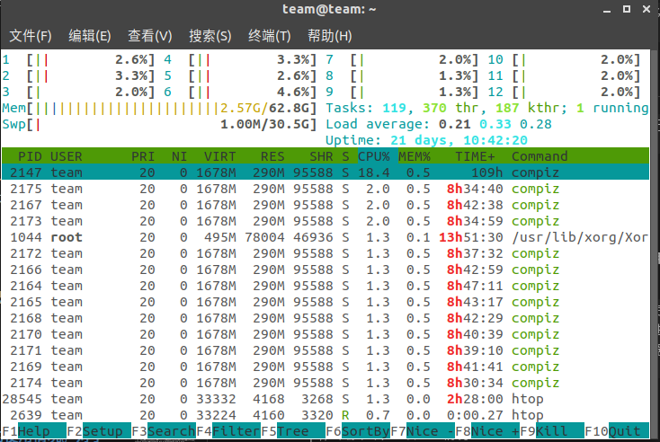

nvidia-smi示例图，图像中每个参数含义可参照这篇博客。[nvidia-smi的参数含义](https://blog.csdn.net/C_chuxin/article/details/82993350)
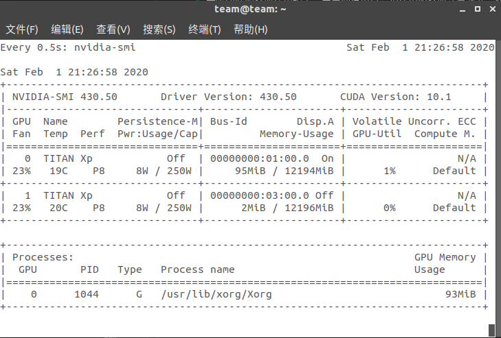

## 1.2、用户类

>用户分为Linux和windows两用户，这里只说明各个用户如何阅读下文的标题号来配置环境。

### 1.2.1、Linux用户（Ubuntu系列）

**Step1 配置SSH：[2.1.1](#user1)-->[2.1.4](#user2)**

**Step2 配置虚拟环境：[3.3.1](#user3)-->[3.3.2](#user4)或者[3.3.1](#user3)**

**Step3 配置调用远程计算资源：[4.1.1](#user5)或[4.1.2](#user6)**

### 1.2.2、Windows用户

**Step1 配置SSH（安装Xshell）：[2.2](#user9)**

**Step2 配置虚拟环境：[3.3.1](#user3)-->[3.3.2](#user4)或者[3.3.1](#user3)**

**Step3 配置调用远程计算资源：[4.2.1](#user8)-->[4.1.1](#user5)或[4.2.2](#user7)**


## 1.3、管理员类

**管理员类需熟悉文档的所有配置流程，掌控系统的功能要点，并及时更新文档说明，达到维护系统的管理员职责!**


# 二、配置本地和远程机器的SSH
>ssh的含义、作用，就不赘述了，可参考这个博客。[博客链接](https://blog.csdn.net/netwalk/article/details/12951031)。这里解决本地机器和远程机器之间进行远程连接问题，包括linux和windows两系统解决方案。

>在阐述之前，先定义（虚构）本地机器（用户名：local）的ip地址为：192.168.112.1，远程机器（用户名：remote）的ip地址：192.168.112.2。本地机器的操作系统是Linux或者windows，远程机器的操作系统是Ubuntu16.04。

>废话说明：你可以发现这两个机器是在局域网里，两者之间是肯定能互通。如果两个机器之间无法连通起来，这有可能一个是内网，一个是外网，两者之间是不能互通，通常需要对内网进行端口映射，一般是买个云服务器做个端口转发。本文假设两者之间是能互通，若不通的话请自行百度解决。

> **额外说明：出于安全问题，使用SSH连接远程机器，将禁用口令登录而使用密钥自动登录。**

## 2.1、 Linux系统（Ubuntu系列）
<span id='user1'></span>

### 2.1.1、安装openssh-client

(user_1)openssh-client是客户端，它的作用是只想登录别的机器的ssh，也就是本地机器用来登录远程机器。安装在local机器中，安装代码如下（打开终端）：

- sudo apt-get install openssh-client  //安装客户端到local机器中
- ssh-keygen  //生成私钥和公钥，一直按回车默认即可

### 2.1.2、安装openssh-server

openssh-server是服务端，用来开放ssh服务，也就是以本机作为远程（remote）服务器，让其他机器访问自己。安装在remote机器中，安装代码如下（打开终端）：

- sudo apt-get install openssh-server   //安装服务端到remote机器中。
- sudo ps -e |grep ssh  //查看ssh有没有打开
- sudo /etc/init.d/ssh start //（可选）打开ssh

### 2.1.3、ssh常见服务命令

- sudo service ssh [stop, start, restart] // 快捷[停止、开启、重启]服务命令或者选择下面的命令

- sudo /etc/init.d/ssh stop  //停止服务

- sudo /etc/init.d/ssh start  //启动服务

- sudo /etx/init.d/ssh restart //重启服务

- exit  //断开连接

<span id='user2'></span>

### 2.1.4、ssh连接操作

>实现自动登录，将本地机器的ssh公钥拷贝到远程机器的ssh中，下次连接只需添加按照下面的连接就可以，不需要添加密码。当然第一次添加是需要输入密码的，还需要管理员将修改远程机器ssh的配置文件，开放密码登录的权限。**具体修改配置可参考[博客](https://www.linuxidc.com/Linux/2015-07/119608.htm)[管理员负责]**。

- ssh-copy-id -i /home/xiaonan/.ssh/id_rsa.pub remote@192.168.112.2 -p 22  //（配置）将本地ssh公钥复制到远程机器的ssh中

- ssh remote@192.168.112.2 -p 22 -o ServerAliveInterval=60  //(日常连接)连接远程机器，'-p'是设置端口，‘-o’操作是设置防止无操作而断开连接。

<span id='user9'></span>

## 2.2、windows系统

### 2.2.1、通过Xshell使用密钥连接Linux

>在windows里使用Xshell来连接远程Linux，[Xshell下载地址](http://wm.makeding.com/iclk/?zoneid=18724)。

1、打开Xshell，新建服务器的连接客户端，配置远程主机的ip地址和端口号。


2、点击用户身份验证，输入远程机器的用户名和密码，然后点击连接！（如无法连接，请联系管理开放权限）
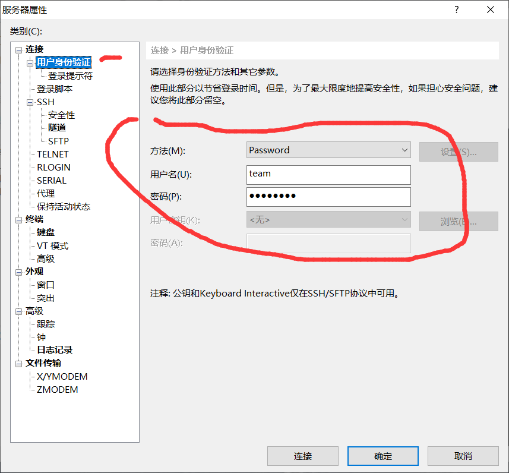

3、**生成SSH密钥。** 为了实现密钥自动登录远程机器（抛弃用户名和密码登录操作），我们需要先生成用户密钥。默认下一步。
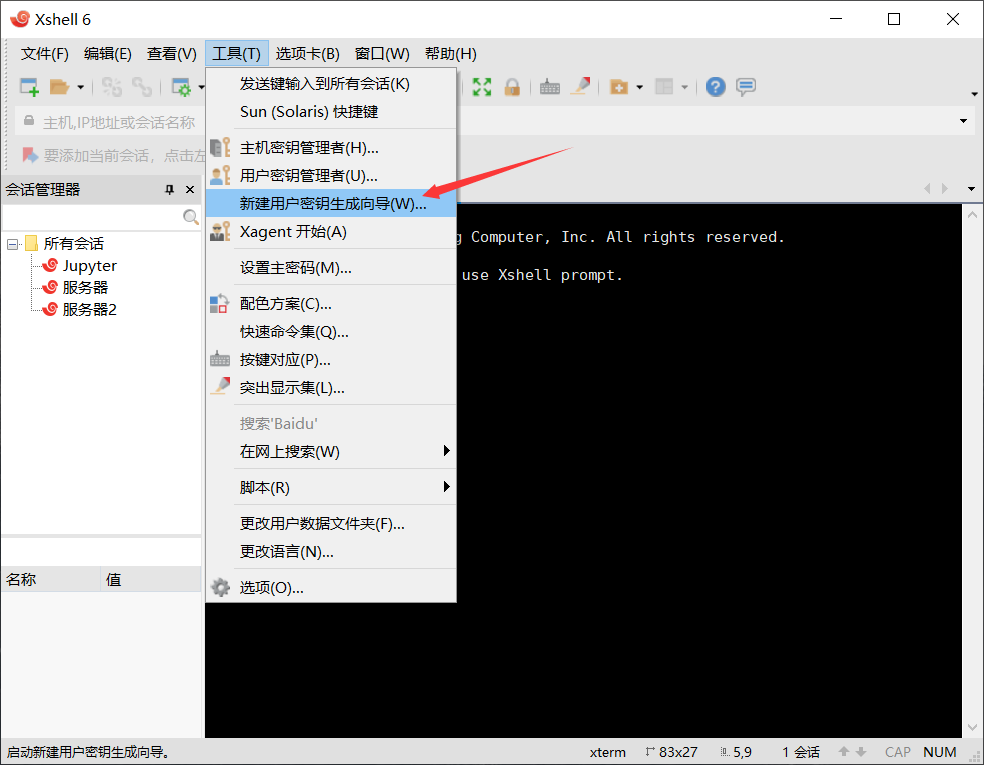
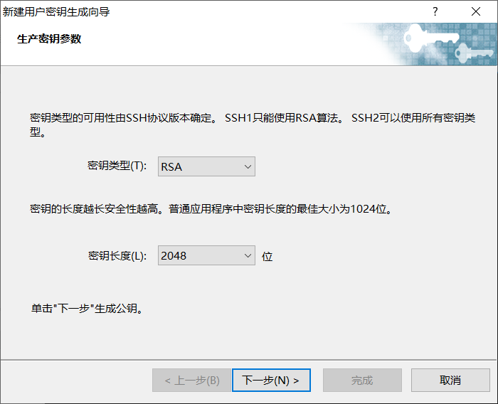


4、需要设置一下密码，设置的简单点，后面配置会用到。
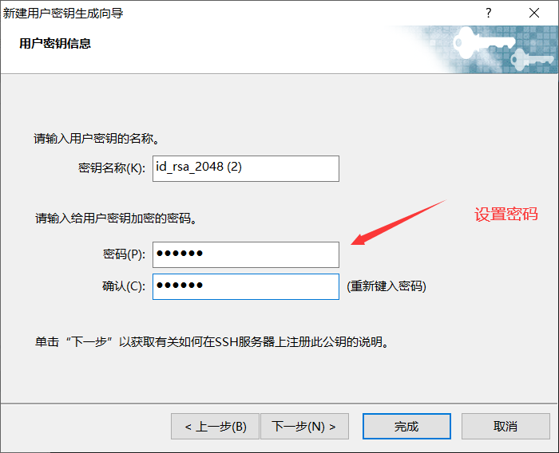

5、保存一下密钥，后面需要把密钥上传到服务器中。点击完成、关闭。
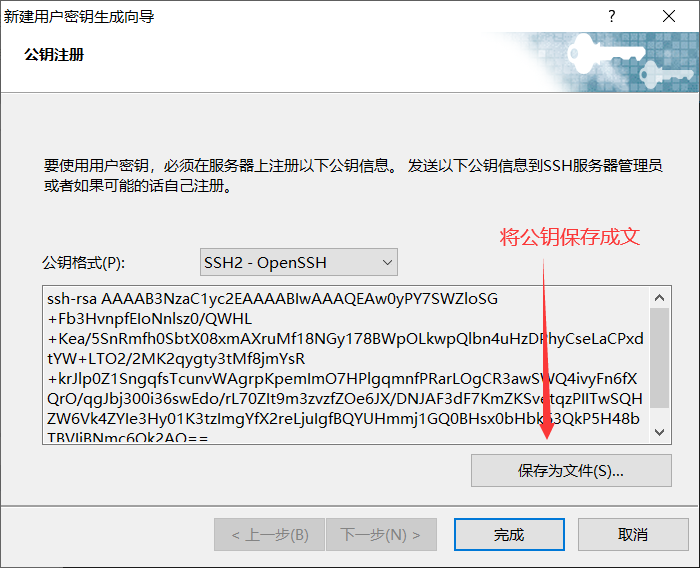


6、通过刚刚1、2步骤进入服务器，通过下面命令进入.ssh文件夹，再将刚刚生成的密钥文件上传到服务器，这里上传只需把文件拖拽到服务上即可完成。

- cd .ssh

- ls
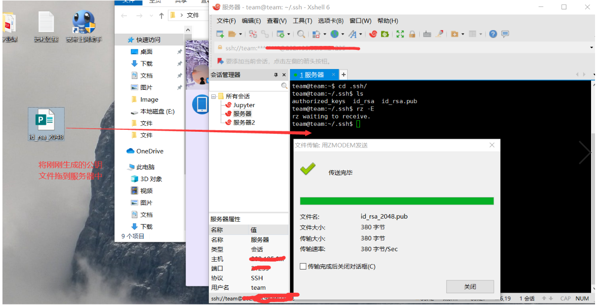

7、通过下面命令查看文件是否上传成功，然后将密钥添加到authorized_keys中，并查看是否添加成功。其中两处横线为xiaonan和Dell用户的密钥，竖线部分为新添加用户的密钥。

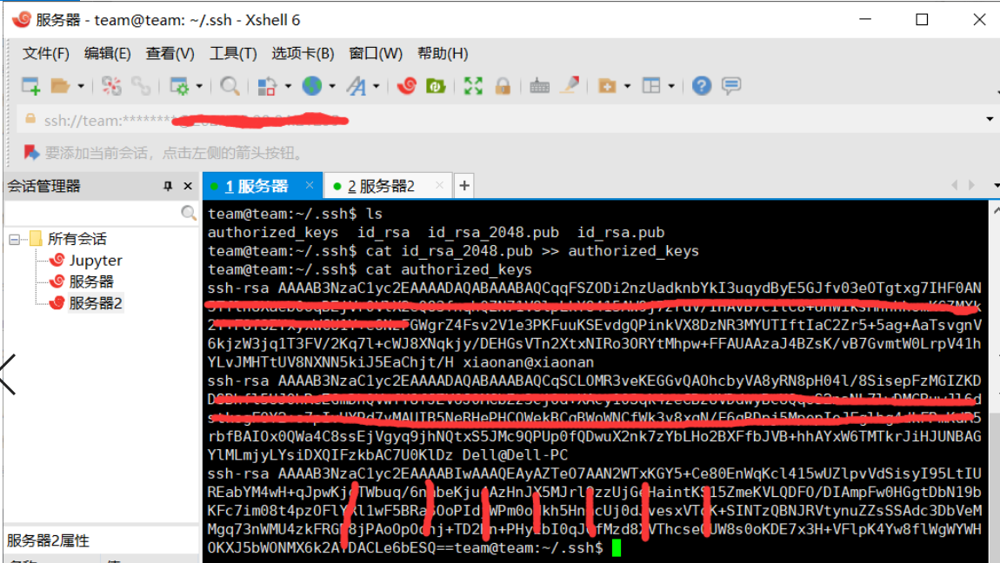

8、重启ssh服务才能使上述配置成功！

- service ssh restart //重启服务，需要输入team用户密码


9、执行2、步骤，选择Public Key选项进行密钥登录，选择生成的密钥，密码即是生成密钥时设置的密码。然后点击连接。


## 2.3、 参考文献

- [Ubuntu环境下SSH的安装及使用](https://blog.csdn.net/netwalk/article/details/12952051)

# 三、使用pyenv对多版本的python进行管理

## 3.1、安装pyenv

> 安装pyenv参照官方文档安装（当前写的文档有可能会跟官方有出入，请查阅之后再安装！）[官方地址链接](https://github.com/pyenv/pyenv)。
>本人服务器系统是ubuntu系列系统，官方也给出了其他系统的安装方法，这里不在赘述。安装我选择了自动安装器（automatic instller）[安装地址链接](https://github.com/pyenv/pyenv-installer)

### 3.1.1、预先准备（满足后续安装python包的要求，直接复制到终端即可）

- sudo apt-get install -y make build-essential libssl-dev zlib1g-dev libbz2-dev libreadline-dev libsqlite3-dev wget curl llvm libncurses5-dev libncursesw5-dev xz-utils tk-dev libffi-dev liblzma-dev python-openssl git

- sudo apt install libedit-dev

### 3.1.2、安装（两者各选其一，推荐第一种）

- curl https://pyenv.run | bash
- curl -L https://github.com/pyenv/pyenv-installer/raw/master/bin/pyenv-installer | bash

### 3.1.3、配置环境（将pyenv加入.bashrc中，这是当前用户中。若是root，则修改.bash_profile ）

- sudo gedit .bashrc
- 在.bashrc文件的底部空白处，添加三行命令(第一条的用户路径根据实际情况进行修改)：
```
export PATH="/home/xiaonan/.pyenv/bin:$PATH"

eval "$(pyenv init -)" 

eval "$(pyenv virtualenv-init -)"
```

- 重启终端（SHELL）输入：pyenv --version，打印版本信息，则说明安装成功

### 3.1.4、更新pyenv

- pyenv update

### 3.1.5、删除pyenv

- rm -fr .pyenv

- 删除.bashrc文件中（在配置环境过程中）添加的三个命令

- 重启终端

## 3.2、配置及管理多个python版本

### 3.2.1、安装python版本

>通过实践发现，按照官方的安装方法，在下载对应版本的python下载速度很慢。所以，本人不采用官方的方法，具体流程如下！

- mkdir /home/xiaonan/.pyenv/cache  （若没有cache文件夹则新建，若已有则跳过此步。这里文件路径根据自己的情况进行修改，即/××/××/.pyenv/cache）

- 前往python官网下载自己想要的python版本（稳定版，即stable），文件格式是***.tar.xz，即是xz压缩的文件。[下载链接](https://www.python.org/downloads/source/)

- cp Python-3.8.1.tar.xz /home/xiaonan/.pyenv/cache   （将下载后的文件移动到cache文件中，这里文件路径根据自己情况进行修改。）

- pyenv install 3.8.1    （安装例如上述python3.8的版本）

- pyenv versions             （查看系统安装的python ）

### 3.2.2、卸载python版本


- pyenv uninstall 3.7.1

### 3.2.3、pyenv的三个基础命令

- pyenv global <python version>   //配置当前用户系统使用的python版本

- pyenv shell <python version>  //配置当前shell（终端）的python版本，退出shell则失效！

- pyenv local <python version> //配置所在目录（项目）的python版本

- pyenv local system  //切换成系统自带的python的版本

### 3.2.4、各个python版本切换操作

>本人系统自带的是python3.6，后来又通过上述安装操作，安装了python3.7和3.8，现在演示各个情况下的切换。

- pyenv versions  //查看拥有的python版本

- 使用pyenv global <version>配置当前用户的系统使用的python版本

    ```
    pyenv global  3.7.6

    pyenv rehash  //对数据库进行更新，才算对当前用户切换完成！
    
    若出现无法切换版本的问题，一般是因为用pyenv指定了local版本。执行"pyenv local --unset"，取消设置local版本。

    ```
    
- 使用pyenv shelll <version>配置当前shell的python版本，退出shell则失效

  ```
  pyenv shell 3.7.6      //只在当前shell(终端)窗口有效, 退出重新登录 或 再打开另外一个窗口不生效

  pyenv shell --unset   //取消当前shell的设置
  ```

- 使用pyenv local <version>配置所在项目（目录）的python版本

    ```
    mkdir test   //实验新建新的文件夹，可以跳过此步，直接想要指定的目录

    cd test

    pyenv local 3.7.6

    pyenv versions  //查看当前文件夹的版本

## 3.3、配置虚拟环境及jupyter使用虚拟环境

> 通过以上操作，已经在服务器中部署了五个python版本（系统自带：python3.5、python2.7，新部署(pyenv管理)：python3.6<3.6.8>、python3.7<3.7.6>、python3.8<3.8.1>）。

>为了防止多用户使用时扰乱系统环境，所以这里设置了使用指南，规范大家的使用。只需修改部分名称，其他的指令可直接粘贴。

>另外说明：没有考虑将Anaconda虚拟环境纳入管理，**通过Anaconda创建虚拟环境的用户可跳过此步。** 这里创建虚拟环境的工具是venv，其他工具未补充。

<span id='user3'></span>

### 3.3.1、创建虚拟环境

**下面在终端的操作指令：**

- pyenv versions        //查看pyenv管理下的python版本

- pyenv shell 3.6.8    //设置当前终端（shell）的python环境是3.6.8。（当终端关闭时，设置会自动消失，不会对原有系统环境造成影响。若使用系统原有的python3.5，python2.7，则跳过此步！）

- python -V    //查看当前的系统python版本

- python -m venv test //（pyenv管理的环境）创建虚拟环境，用户只需把“test”换成自己的虚拟环境的名称。

- python\python3 -m venv test //（使用python2.7、3.5的环境）创建虚拟环境，用户只需把‘test'换成自己的虚拟环境名称

- source test/bin/activate  //激活虚拟环境，会发现终端出现虚拟环境的名字。当然，这里也可以重进终端进行激活。

- python -V  //查看虚拟环境的python版本

- deactivate  //退出虚拟环境
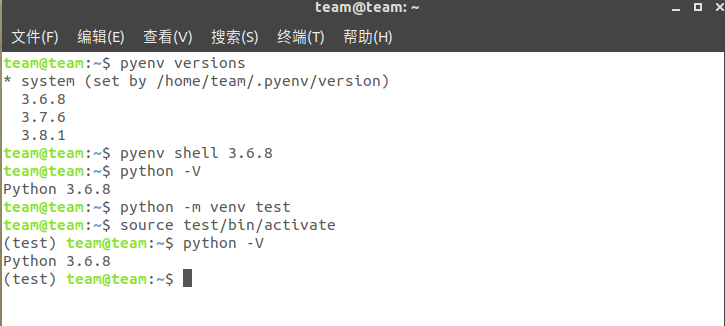

**额外补充:打包依赖库和安装依赖库**

- pip freeze  > deployment.txt  //将系统python库或者虚拟环境python（需激活）写入文本

- pip install -r deployment.txt  //安装依赖文件中的python库

- cat deployment.txt | xargs -n 1 pip install //（推荐）安装依赖文件中的python库，并可跳过缺少的库

**关于venv创建虚拟环境其他的功能，可参考官方Python文档。[Python文档](https://docs.python.org/zh-cn/3/tutorial/venv.html)**

<span id='user4'></span>

### 3.3.2、Jupyter使用虚拟环境

**在上述创建虚拟环境操作之后，重启一个终端，并输入如下命令：**

- source test/bin/activate  //激活虚拟环境，这里的虚拟环境只是用来说明，用户可以换成自己的虚拟环境。

- pip install jupyter   //（可选操作，不推荐）在激活的虚拟环境下安装jupyter notebook

- pip install jupyterlab  //(可选操作， 推荐)，在激活的虚拟环境下安装jupyter lab

- ipython kernel install --name 'test' --user  //将虚拟环境安装到jupyter内核中（给用户权限），这里的'test'就是前面新建的虚拟环境的名称，换用自己对应的虚拟环境即可。

- cd /home/team/.local/share/jupyter/kernels/  && ls  //查看jupyter内核中是否存在刚刚创建的虚拟环境

- rm -r test  //(可选操作，删除操作)进入上面jupyter内核中删除指定的虚拟环境文件夹即可。

**关于JupyterLab的使用技巧，可以参考这篇文章。[JupyterLab使用技巧](https://zhuanlan.zhihu.com/p/67959768)**
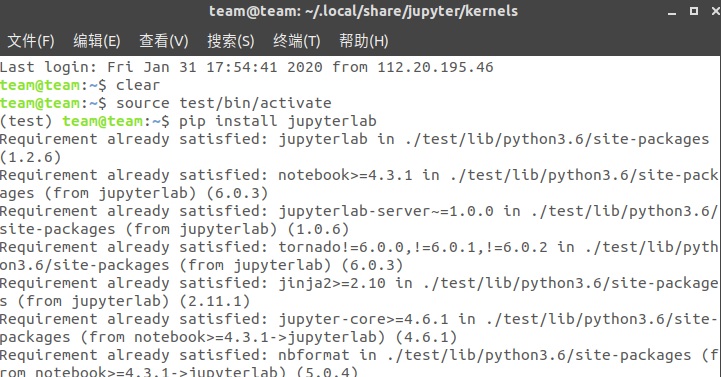
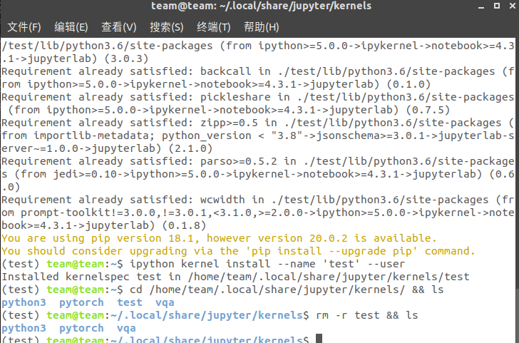


## 3.4、参考文献

- [Python多版本管理器-pyenv 介绍及部署记录](https://www.cnblogs.com/kevingrace/p/10130801.html)

- [pyenv官方地址链接](https://github.com/pyenv/pyenv)。

- [pyenv安装地址链接](https://github.com/pyenv/pyenv-installer)

- [Python文档](https://docs.python.org/zh-cn/3/tutorial/venv.html)

- [JupyterLab使用技巧](https://zhuanlan.zhihu.com/p/67959768)

# 四、通过SSH本地调用远程计算资源（Pycharm，JupyterLab配置）

## 4.1、Linux系统（Ubuntu系列）

<span id='user5'></span>

### 4.1.1、Pycharm(版本2019.3)实现


**Step1 将本地项目同步到远程服务中：**

1、打开Pycharm，选择导航栏，依次选择：Tools-->Deployment-->Configuration


2、选择最上的+，再选择SFTP协议，输入名称，填写相关信息（如下图所示）
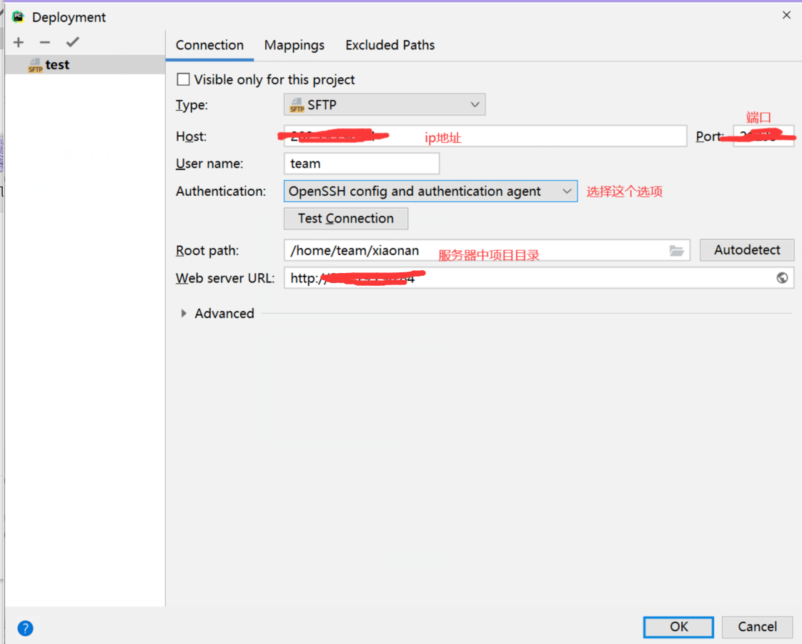

3、修改Mappings中的Deployment path：/


4、修改Excluded Paths中的Deployment path，将远程服务器中的部分文件排除在同步的文件中。点击OK完成。


**Step2 配置远程服务器的Python解释器:**

1、打开导航栏：Files-->Settings-->Project Interpreter
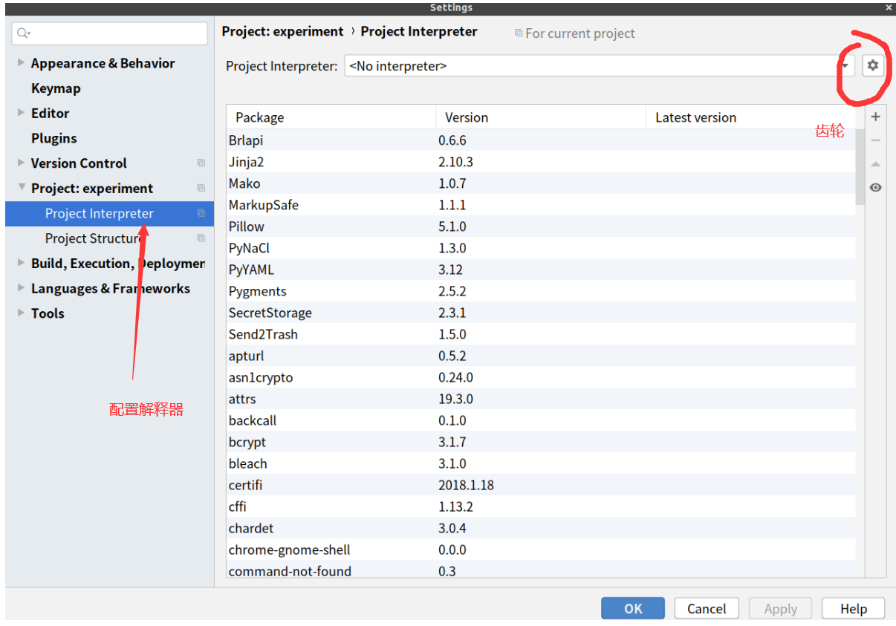

2、点击齿轮来添加解释器，选择SSH Interpreter，选择存在的server configuration，也就是刚刚配置的项目，点击Move进行下一步的配置。


3、修改默认的python解释器为上面设置的虚拟环境解释器。修改同步目录，将默认的远程值改成自己项目的根（/）下，最后点击Finish。
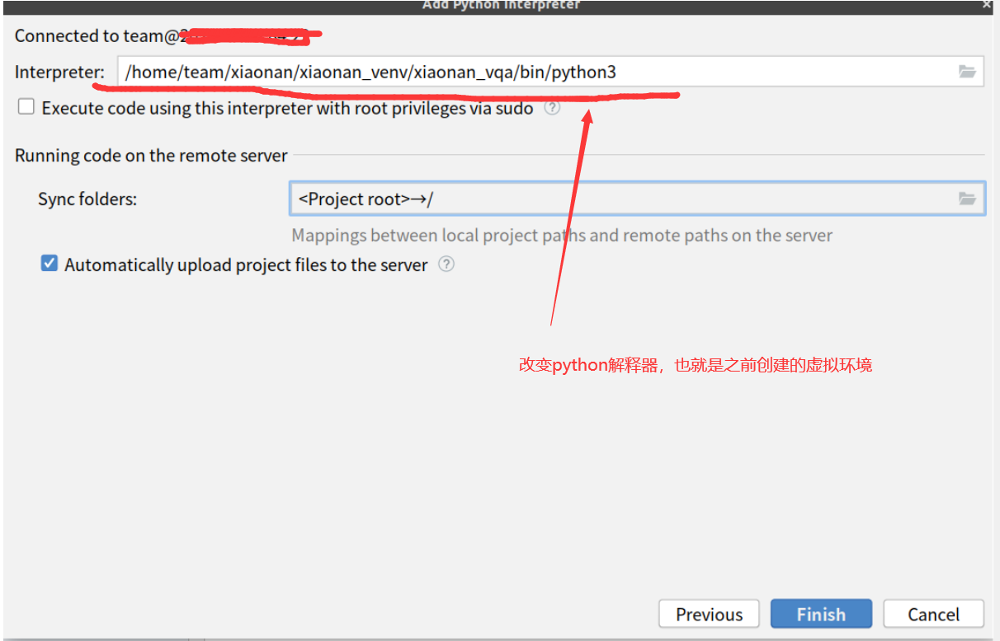


4、测试结果，在本地新建test.py，并输出‘Hello World’，按Ctrl+S会保存本地文件并同步到远程服务器的项目中。运行文件，会发现计算是在远程服务器完成的，没有占用本机的计算资源。
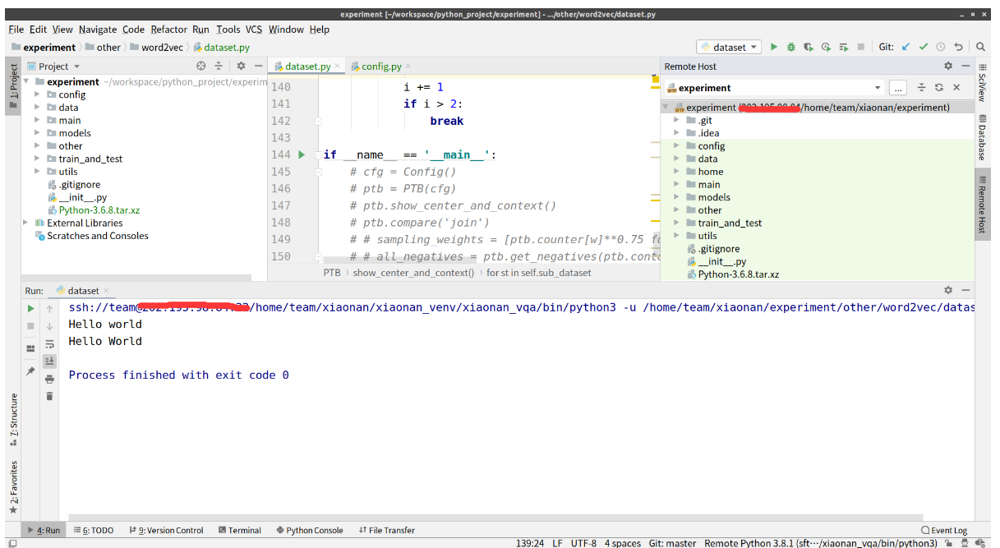

<span id='user6'></span>

### 4.1.2、JupyterLab实现


>JupyterLab使用远程计算资源，主要是通过ssh建立本地（local）机器和远程（remote）机器端口转发隧道，即两个机器之间建立端口对接，保持远程机器中的JupyterLab端口映射到本地机器，本地机器可以类似于在本地安装了JupyterLab并使用它。

>**使用说明**：通过实验发现，在远程机器后台打开了JupyterLab，用户在本地机器使用它，当用户运行一些程序并且占用计算资源（内存）。若远程机器没有关闭JupyterLab，则程序会一直占用计算资源（内存）得不到释放。所以，这里设置了一些使用规范，虽然会稍有点麻烦，但能更充分的使用计算资源（内存）。

1、本地机器打开终端，并通过ssh连接上远程机器。这里假定远程机器（用户名：remote）的ip地址，具体ip视自己机器而定，ip地址：192.168.111.2

- ssh remote@192.168.111.2 -p 22   //连接上远程机器，接下来会让输入用户密码。

- cd xiaonan/    //进入自己的文件夹中

-  jupyter lab --no-browser  --port=1222  //端口可随意设置，若出现报错，有可能和其他端口冲突，改变可用端口即可。实验室使用规范：研一同学使用1000～1999范围内的端口，研二同学使用2000～2999，研三同学使用3000～3999。
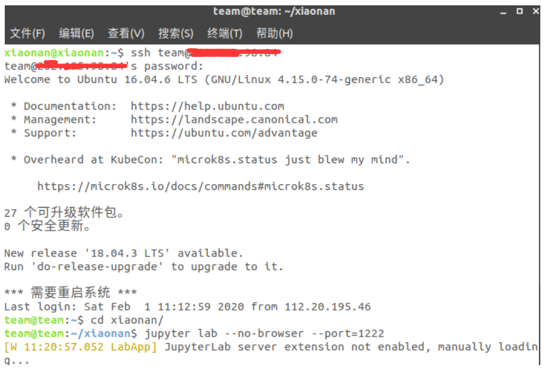

2、再重新打开一个终端，建立本地机器和远程机器的端口隧道。

- ssh remote@192.168.111.2 -p 22 -NL 1234:localhost:1222  //-p 22:这是ssh的端口，1234:localhost:1222，第一个1234是本地机器端口，可以随意设置。第二个1222即是上述建立的端口。
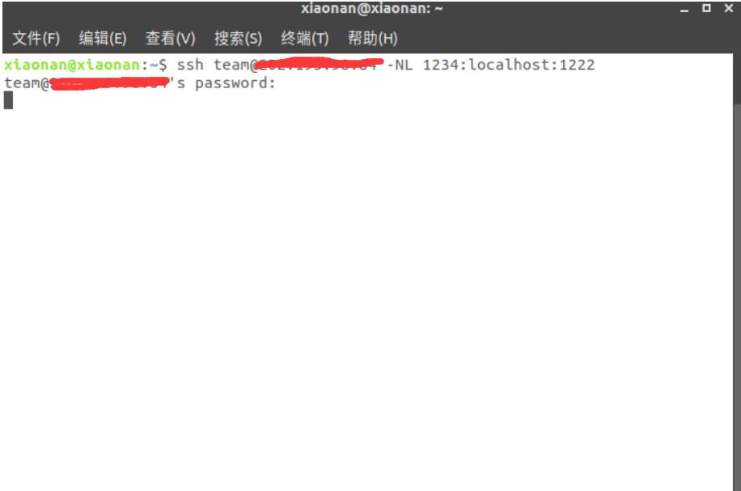

- 打开本地浏览器，输入localhost:1234，输入登录密码（远程用户的密码）。


## 4.2、Windows系统

<span id='user8'></span>

### 4.2.1、Pycharm(版本2019.3)实现

>window的配置类似于Linux中的配置，可以查看上述Linux的配置流程。但是在2、步骤时windows是不同的。windows用户需要从Xshell中导出私钥，在Pycharm中选择私钥进行连接。

1、打开Xshell中的用户密钥管理者，选择前面生成的密钥并导出，选择特定格式的私钥保存。


2、输入密码，即生成密钥时设置的密码。


3、在Pycharm中进行配置，选择‘Key pair’，选择刚刚导出的私钥，‘Passphrase’是生成密钥时设置的密码。其他操作流程如Linux所示。
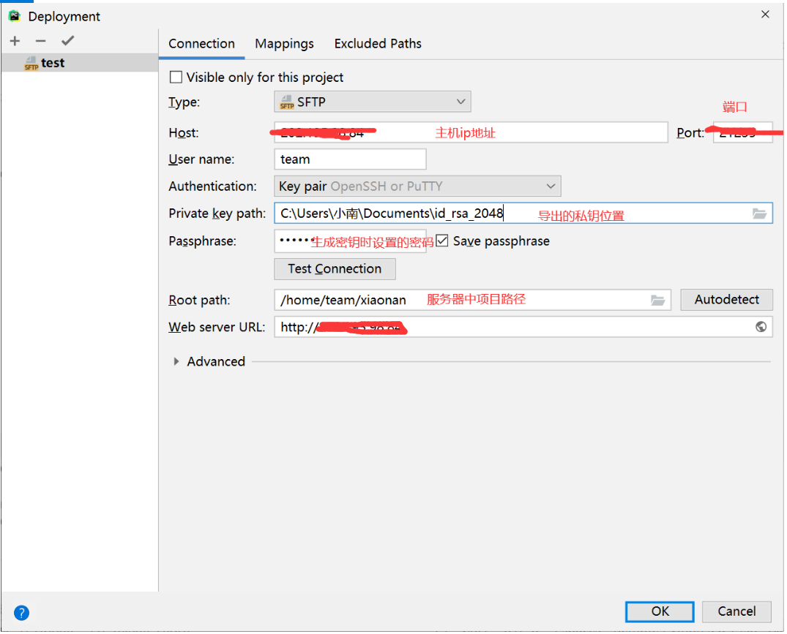

<span id='user7'></span>

### 4.2.2、JupyterLab实现

>Jupyter的实现原理在Linux实现中已阐述，可查看上述。下面具体讲述使用Xshell配置流程。

1、打开Xshell，新建Jupyter的连接客户端，配置远程主机的ip地址，然后点击用户身份验证，选择‘Public Key’进行连接。
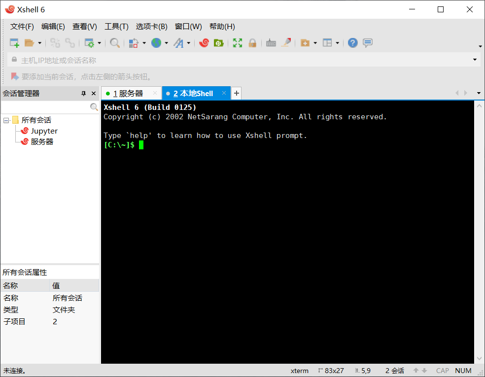


2、为了能方便登录进远程机器之后直接打开Jupyter Lab，这里设置了登录脚本，点击登录脚本。添加两个命令：

- cd  xiaonan/  //进入自己的文件目录

- jupyter lab --no-browser --port=2212 //端口号随意设置，但要记住后续需要用到，并不和系统中存在的端口号冲突

具体操作如图所示：
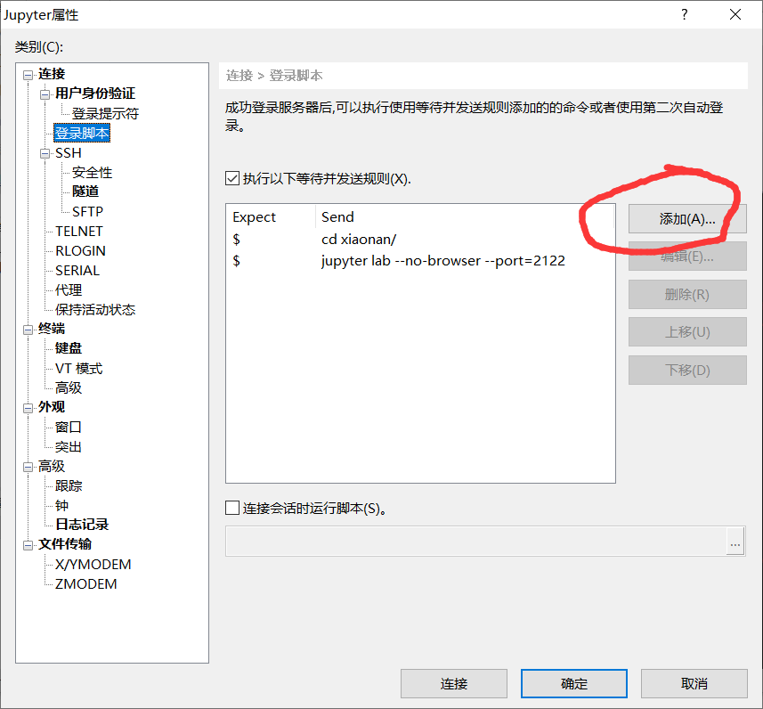

3、在远程机器打开了后台JupyterLab，我们需要在本地机器上建立和远程机器JupyterLab的端口隧道，来实现本地机器使用JupyterLab。具体操作：点击隧道，点击添加按钮，添加如图所示的信息。本地端口可以随意设置，只要不和本地机器的端口冲突即可，远程端口就是步骤2设置的JupyterLab端口，这里需要一致，否则不起作用。最后点击确定，然后连接，在浏览器输入localhost:1234。
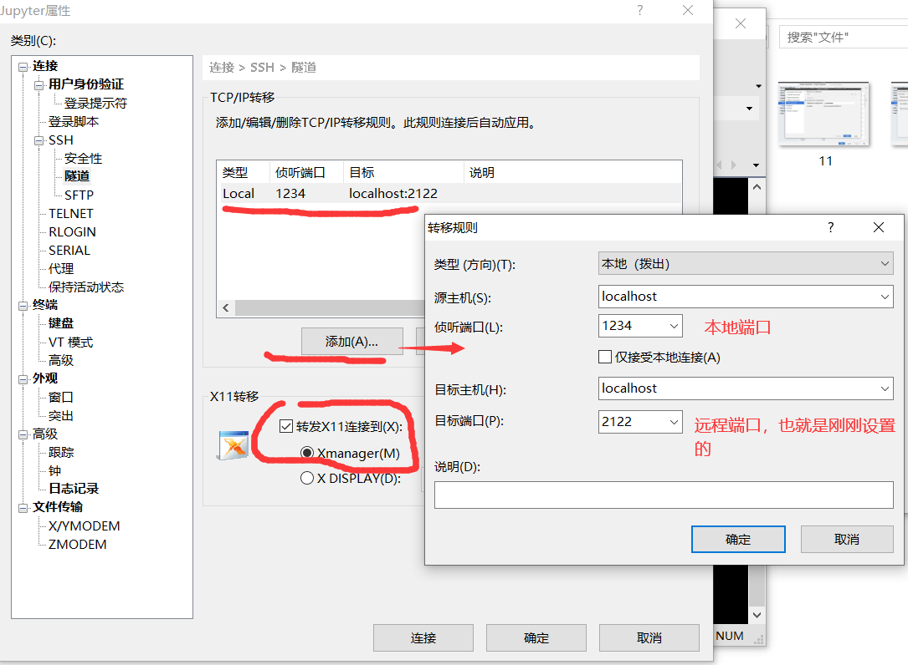

# 5、常见系统问题

## 5.1、防止黑客攻击
>没想到第一次系统问题竟然是这种硬核的问题，服务器确实遭到了黑客的攻击。根据黑客留下来的文件推测，大概是使用我们服务器进行挖矿（比特币）。2020年2月6号凌晨5点服务器遭到入侵，这也是个苦难的一年（武汉肺炎肆虐），当时我的心真是很难受！我在艰难的防病毒，还得抽出时间来防服务器中毒！当时服务器内存倒是没有占满，而是把六块CPU拉满（总共12块），由于当时过于心急把病毒程序杀掉，没有想起来查看显存如何，大概两块基本都满了！起初用户密码是被修改的，我根本没有没办法通过ssh远程进来。不过，我还是留了一手，也不知道这位黑客是真不知道还是给我留情！我们服务器不是真正的服务器，我们习惯使用Ubuntu这种桌面化的linux系统。我在放假之前在服务器中预留TeamViewer（远程工具），这个工具使得我很快把机器夺回来，要是让他使劲的挖，非把我们的服务器挖坏不可！（而且那个时候因为疫情问题，大家都在家里，根本没有人在学校。）可有个问题，服务器只有一个用户team，现在密码被改了，我该如何进入？有可能你会想到root，可我从游客登录进去从终端没权限登录root，远程也没办法连得上，因为root里我没有安装ssh，我只把ssh安装在了team用户里。后来想起来，我可以通过TeamViewer这个远程界面打开虚拟终端（按Ctrl+F1~6），通过这个终端登录进root！这是个关键，这里也不知道是那个黑客没有考虑修改我的root密码，还是故意给我留一点生机，让我能够摸索到这里！进入root里那不就是拥有最高支配权，通过top找出病毒程序的pid，再通过kill利剑秒杀它，再通过passwd把我的小宝贝team改成我的名下！就这样，折腾到下午的1点半左右，终于把我们的机器夺回来了！我一开始发现是在早上九点多的时候，莫怪我那么晚才起，在家是真的爬不起来。但是，这也只是第一步，我让它的程序不运行了。可它仍躲在系统里，当时通过top是知道执行了什么程序，那是个定时程序，它会在某个时间段重启，所以下面是个漫长的排查之路！首先的思路还是先从那个运行程序入手，通过crontab -l查到小病毒躲在哪里了。当然，在这之前我大量的阅读cron的使用方法，发现也有好多用户类似于这种被攻击。我既然知道了你小东西在哪了，那我的思路就明确了！我把crontab卸载的很彻底，卸载的干干净净，首先不让你在我睡觉的时候重启，其次再把这小东西删的干干津津！这下系统里算干净了！下面考虑的就是防止黑客再次入侵进来，这就需要提升ssh安全级别，这次被攻击也是理所当然的事！像我起了个用户名team，然后密码是team123，然后服务器安然的放到公网里！你说，不攻击你攻击谁！哈哈！通过大量调研，提升安全等级有四个思路：
>>1、使用SSH秘钥自动登录、服务器禁用SSH口令登录并修改SSH的默认端口！参考[博客](https://blog.csdn.net/yoywow/article/details/52152866)

>> 2、把你那傻乎乎的密码改的复杂点，什么叫复杂，就是他们用暴力破解软件破解你的密码需要运行一万亿年！不过，你得吃点苦，每次输入密码时你会很难受！！！[随机密码](https://suijimimashengcheng.51240.com/)

>>3、添加防火墙，组织除了你设置的SSH端口以外的所有连接以及你认为的必要的其他连接。参考[博客](https://www.infvie.com/ops-notes/sshd-violent-cracking.html)

>>4、使用Fail2Ban防御工具，屏蔽黑客多次进行连接失败的ip地址，一般和防火墙一起用！参考[博客](https://www.sundayle.com/fail2ban/)

> **这家伙(黑客)很阴险！！！** 他恐怕预料到我会抢回机器，把密码改的复杂点，并且也会考虑使用SHH秘钥自动登录，禁用口令提升SHH的安全性，并且会忘记查看服务器用户公钥储存库！因为网上教程都不需要查看，直接从本地添加到服务器里就可以！但我偏不，我通过在服务器里运行命令cat  .ssh/authorized_keys ,发现了蹊跷，有一个神秘用户的公钥在库里待着。我在查看这个库之前，从没有使用过SHH秘钥自动登录！这里说明这个公钥的厉害性，使用这个公钥会使得我上面第一步和第二步的操作都是白费！（端口这里会费点时间，但通过暴力破解都是能进来！）因为远程服务器现在只容许和公钥库中存在的用户公钥匹配才可以进来！你说何其阴险！！后来通过阅读他小病毒的代码，也进一步证实他修改秘钥库的文件，并删除进入系统浏览痕迹！不过，这黑客恐怕像是新手，我还是查出蛛丝马迹！！下面是一些事实的截图！！

1、通过top查看到了cron程序（定时器，运载小病毒）的执行，并拉满了6块cpu！（第一行）


2、通过cat /var/log/auth.log | grep 'Accepted' 命令查看Ubuntu登录者的信息（ip地址），发现一个可疑的ip地址:112.169.152.10，这是韩国首尔地方的ip地址，再结合日期：2月6日5点17，谁那么早就用服务器了！据我所知的人（实验室里的人），应该没有那么早的把！！哈哈！！这黑客删来删去，还是没有删干净！！不行呀！！


3、通过crontab -l查到了小病毒的藏身之所：/home/team/.bashtemp，从这里又觉得这小哥哥（黑客）挺厉害的，把文件弄成了隐藏文件，而且文件命名很有系统文件的味道！但你的狐狸尾巴还是很好揭示的！进一步查看他的代码，找到了删除系统日志文件和修改秘钥库的代码！！通过查看文件创建时间，是2月6号早上5:46，可以进一步验证这正是小病毒库！
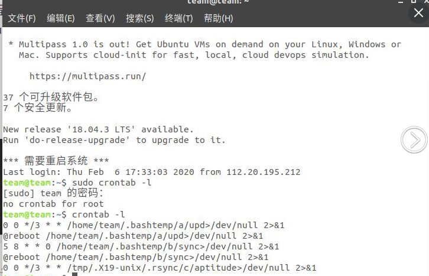
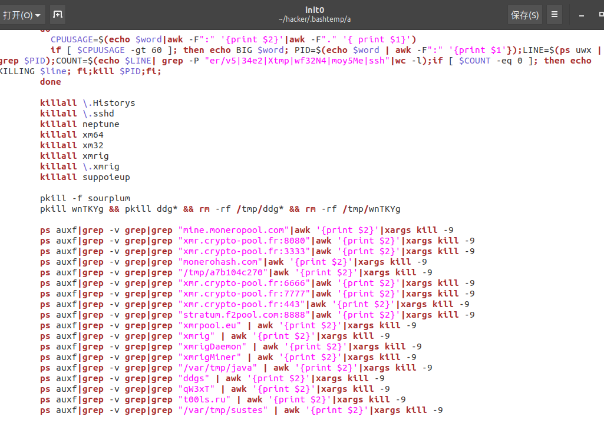
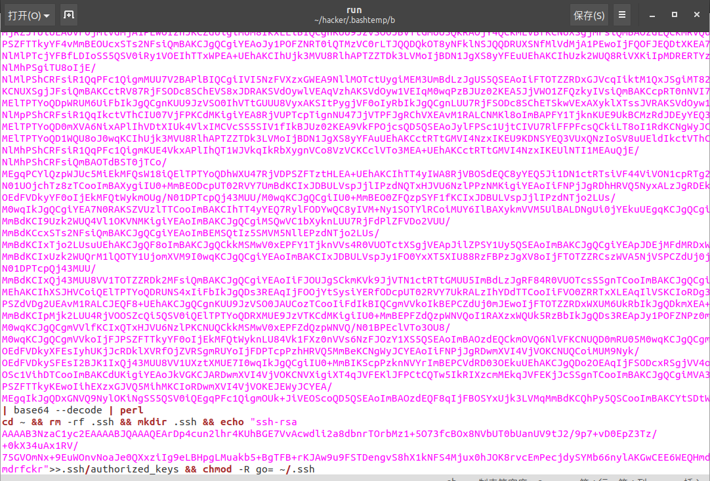


4、这是当时查看秘钥库时存在的秘钥，秘钥用户名：mdrfckr正是上面图片代码的秘钥！
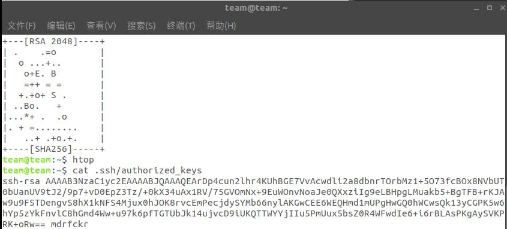

## 5.2、参考文献

>本来是一个技术指南，好像写成故事了！不过应该挺不错的把！下面的参考文献可以对于黑客入侵的检测有个认知，可以阅读一下！！

[黑客有哪些攻击方式攻击网站服务器](https://cn.bluehost.com/blog/security/8595.html)

[Linux入*侵分析（二）分析SSH登录日志](https://blog.51cto.com/winhe/2114533)

[SSH入侵事件日志分析和跟踪](http://www.safebase.cn/article-255737-1.html)

[SSH 使用密钥登录并禁止口令登录实践](https://www.linuxidc.com/Linux/2015-07/119608.htm)

[Linux服务器被入侵](https://www.jianshu.com/p/cad708536ebb)

[CentOS7安装Fail2ban+Firewalld防止SSH或vsftpd爆破](https://www.infvie.com/ops-notes/sshd-violent-cracking.html)

[使用 fail2ban 防范暴力破解ssh vsftp 与CC攻击](https://www.sundayle.com/fail2ban/)